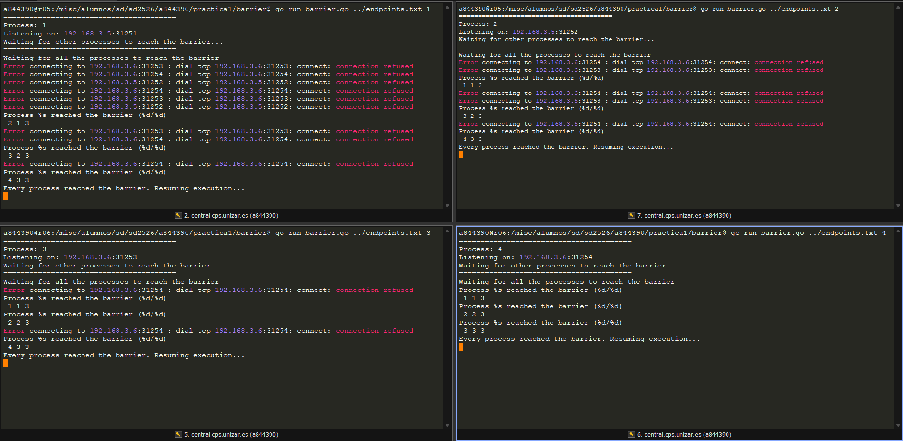

# Práctica 1

Curso: Sistemas Distribuidos (https://www.notion.so/Sistemas-Distribuidos-263c8d9d3c3f80de82b1f86d3904f9ad?pvs=21)
Estado: En progreso
Fecha: 23 de septiembre de 2025 → 7 de octubre de 2025


### Notas

| Pareja | Puertos | Máquinas |
| --- | --- | --- |
| 7 | 31250 → 31259 | 192.168.3.5 → 192.18.3.8 |

192.168.3.5 : 31250 → Servidor 

Script nav.sh:

```powershell
#!/bin/bash

cd /misc/alumnos/sd/sd2526/a844390
```

## Análisis de Prestaciones de Red

### En la misma máquina

**TCP:**

```bash
a844390@r05:/misc/alumnos/sd/sd2526/a844390/practica1/network/client_tcp$ go run tcp_client.go 192.168.3.5:31251
Attempting to connect to server (expecting failure)...
Failed to connect: dial tcp 192.168.3.5:31251: connect: connection refused
Failed Dial took: 607.492µs; 608.511µs;760.749µs

Please start the server, then press Enter.

Attempting to connect to server again (expecting success)...
Dial (with server running) took: 1.069356ms;1.18852ms; 1.137891ms
```

**UDP:**

```bash
a844390@r05:/misc/alumnos/sd/sd2526/a844390/practica1/network/client_udp$ go run client_udp.go 192.168.3.5:31251
Sending a character to the UDP server...
Error receiving message: read udp 192.168.3.5:37558->192.168.3.5:31251: recvfrom: connection refused
a844390@r05:/misc/alumnos/sd/sd2526/a844390/practica1/network/client_udp$ go run client_udp.go 192.168.3.5:31251
Sending a character to the UDP server...
Round-trip time for UDP message: 333.513µs
a844390@r05:/misc/alumnos/sd/sd2526/a844390/practica1/network/client_udp$ go run client_udp.go 192.168.3.5:31251
Sending a character to the UDP server...
Round-trip time for UDP message: 555.658µs
a844390@r05:/misc/alumnos/sd/sd2526/a844390/practica1/network/client_udp$ go run client_udp.go 192.168.3.5:31251
Sending a character to the UDP server...
Round-trip time for UDP message: 457.715µs

```

### En distinta máquina

**TCP:**

```bash
a844390@r06:/misc/alumnos/sd/sd2526/a844390/practica1/network/client_tcp$ go run tcp_client.go 192.168.3.5:31250
Attempting to connect to server (expecting failure)...
Failed to connect: dial tcp 192.168.3.5:31250: connect: connection refused
Failed Dial took: 775.99µs; 788.862µs; 700.567µs

Please start the server, then press Enter.

Attempting to connect to server again (expecting success)...
Dial (with server running) took: 1.238874ms; 942.527µs; 1.415985ms;

```

**UDP:**

```bash
a844390@r06:/misc/alumnos/sd/sd2526/a844390/practica1/network/client_udp$ go run client_udp.go 192.168.3.5:31251
Sending a character to the UDP server...
Error receiving message: read udp 192.168.3.6:53566->192.168.3.5:31251: recvfrom: connection refused
a844390@r06:/misc/alumnos/sd/sd2526/a844390/practica1/network/client_udp$ go run client_udp.go 192.168.3.5:31251
Sending a character to the UDP server...
Round-trip time for UDP message: 739.01µs
a844390@r06:/misc/alumnos/sd/sd2526/a844390/practica1/network/client_udp$ go run client_udp.go 192.168.3.5:31251
Sending a character to the UDP server...
Round-trip time for UDP message: 966.86µs
a844390@r06:/misc/alumnos/sd/sd2526/a844390/practica1/network/client_udp$ go run client_udp.go 192.168.3.5:31251
Sending a character to the UDP server...
Round-trip time for UDP message: 583.994µs

```

## Sincronización mediante Barrera distribuida

**Endpoint 1**

```bash
a844390@r05:/misc/alumnos/sd/sd2526/a844390/practica1/barrier$ go run barrier.go ../endpoints.txt 1
========================================
Process: 1
Listening on: 192.168.3.5:31251
Waiting for other processes to reach the barrier...
========================================
Waiting for all the processes to reach the barrier
Error connecting to 192.168.3.6:31253 : dial tcp 192.168.3.6:31253: connect: connection refused
Error connecting to 192.168.3.6:31254 : dial tcp 192.168.3.6:31254: connect: connection refused
Error connecting to 192.168.3.5:31252 : dial tcp 192.168.3.5:31252: connect: connection refused
Error connecting to 192.168.3.6:31254 : dial tcp 192.168.3.6:31254: connect: connection refused
Error connecting to 192.168.3.6:31253 : dial tcp 192.168.3.6:31253: connect: connection refused
Error connecting to 192.168.3.5:31252 : dial tcp 192.168.3.5:31252: connect: connection refused
Process %s reached the barrier (%d/%d)
 2 1 3
Error connecting to 192.168.3.6:31253 : dial tcp 192.168.3.6:31253: connect: connection refused
Error connecting to 192.168.3.6:31254 : dial tcp 192.168.3.6:31254: connect: connection refused
Process %s reached the barrier (%d/%d)
 3 2 3
Error connecting to 192.168.3.6:31254 : dial tcp 192.168.3.6:31254: connect: connection refused
Process %s reached the barrier (%d/%d)
 4 3 3
Every process reached the barrier. Resuming execution...

```

**Endpoint 2**

```bash
a844390@r05:/misc/alumnos/sd/sd2526/a844390/practica1/barrier$ go run barrier.go ../endpoints.txt 2
========================================
Process: 2
Listening on: 192.168.3.5:31252
Waiting for other processes to reach the barrier...
========================================
Waiting for all the processes to reach the barrier
Error connecting to 192.168.3.6:31254 : dial tcp 192.168.3.6:31254: connect: connection refused
Error connecting to 192.168.3.6:31253 : dial tcp 192.168.3.6:31253: connect: connection refused
Process %s reached the barrier (%d/%d)
 1 1 3
Error connecting to 192.168.3.6:31254 : dial tcp 192.168.3.6:31254: connect: connection refused
Error connecting to 192.168.3.6:31253 : dial tcp 192.168.3.6:31253: connect: connection refused
Process %s reached the barrier (%d/%d)
 3 2 3
Error connecting to 192.168.3.6:31254 : dial tcp 192.168.3.6:31254: connect: connection refused
Process %s reached the barrier (%d/%d)
 4 3 3
Every process reached the barrier. Resuming execution...

```

**Endpoint 3**

```bash
a844390@r06:/misc/alumnos/sd/sd2526/a844390/practica1/barrier$ go run barrier.go ../endpoints.txt 3
========================================
Process: 3
Listening on: 192.168.3.6:31253
Waiting for other processes to reach the barrier...
========================================
Waiting for all the processes to reach the barrier
Error connecting to 192.168.3.6:31254 : dial tcp 192.168.3.6:31254: connect: connection refused
Process %s reached the barrier (%d/%d)
 1 1 3
Process %s reached the barrier (%d/%d)
 2 2 3
Error connecting to 192.168.3.6:31254 : dial tcp 192.168.3.6:31254: connect: connection refused
Process %s reached the barrier (%d/%d)
 4 3 3
Every process reached the barrier. Resuming execution...
```

**Endpoint 4**

```bash
a844390@r06:/misc/alumnos/sd/sd2526/a844390/practica1/barrier$ go run barrier.go ../endpoints.txt 4
========================================
Process: 4
Listening on: 192.168.3.6:31254
Waiting for other processes to reach the barrier...
========================================
Waiting for all the processes to reach the barrier
Process %s reached the barrier (%d/%d)
 1 1 3
Process %s reached the barrier (%d/%d)
 2 2 3
Process %s reached the barrier (%d/%d)
 3 3 3
Every process reached the barrier. Resuming execution...
```

